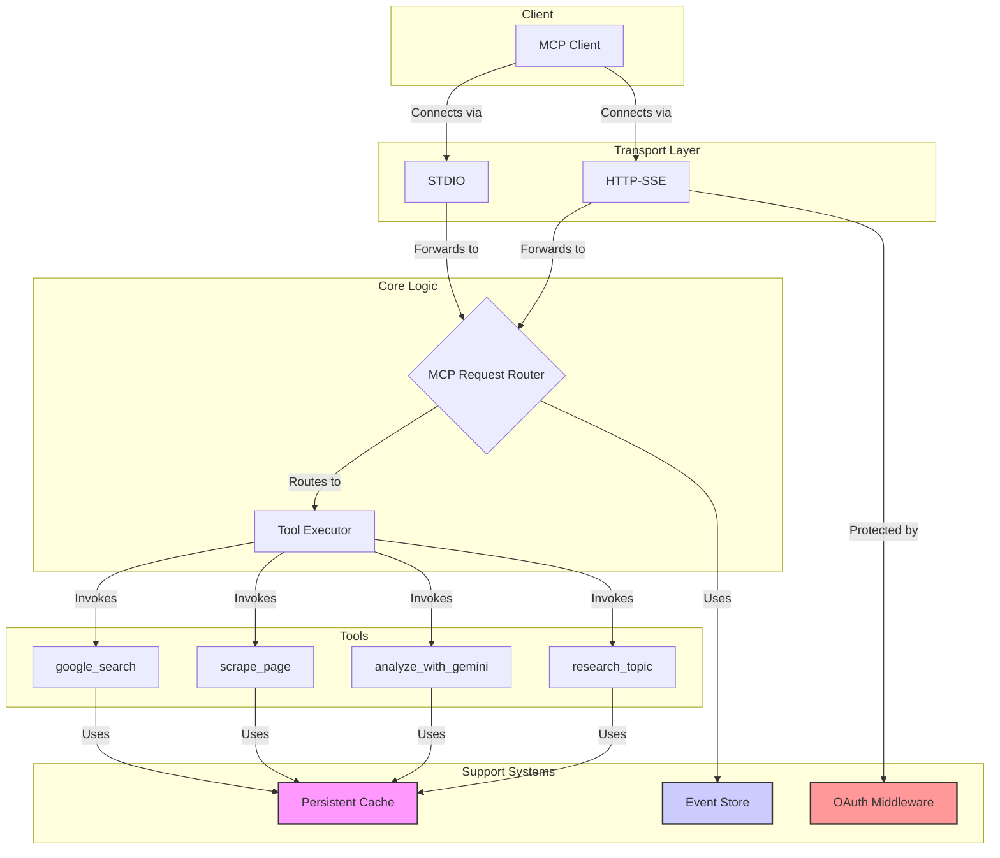

# Google Researcher MCP Server

[](https://github.com/zoharbabin/google-research-mcp/actions/workflows/test.yml)
[](https://codecov.io/gh/zoharbabin/google-research-mcp)
[](https://opensource.org/licenses/MIT)
[](https://nodejs.org/)
[](CONTRIBUTING.md)

> **Empower AI assistants with robust, persistent, and secure web research capabilities.**
>
> This server implements the [Model Context Protocol (MCP)](https://github.com/zoharbabin/google-research-mcp), providing a suite of tools for Google Search, content scraping, and Gemini AI analysis. It's designed for performance and reliability, featuring a persistent caching system, comprehensive timeout handling, and enterprise-grade security.
>
> **🎉 Latest Update (v1.2.1):** Fixed critical issue where `scrape_page` and `research_topic` tools were returning placeholder test content instead of actual scraped data. All tools now return real web content as expected.


## Table of Contents

- [Google Researcher MCP Server](#google-researcher-mcp-server)
  - [Table of Contents](#table-of-contents)
  - [Why Use This Server?](#why-use-this-server)
  - [Features](#features)
  - [System Architecture](#system-architecture)
  - [YouTube Transcript Extraction](#youtube-transcript-extraction)
    - [Key Features](#key-features)
    - [Supported Error Types](#supported-error-types)
    - [Retry Behavior](#retry-behavior)
    - [Example Error Messages](#example-error-messages)
  - [Getting Started](#getting-started)
    - [Prerequisites](#prerequisites)
    - [Installation \& Setup](#installation--setup)
    - [Running the Server](#running-the-server)
  - [Usage](#usage)
    - [Available Tools](#available-tools)
    - [Client Integration](#client-integration)
      - [STDIO Client (Local Process)](#stdio-client-local-process)
      - [HTTP+SSE Client (Web Application)](#httpsse-client-web-application)
    - [Management API](#management-api)
    - [Docker Usage](#docker-usage)
      - [MCP Client Configuration](#mcp-client-configuration)
    - [NPX Configuration](#npx-configuration)
      - [Claude Code Configuration](#claude-code-configuration)
      - [Roo Code Configuration](#roo-code-configuration)
  - [Performance \& Reliability](#performance--reliability)
    - [YouTube Transcript Extraction Performance](#youtube-transcript-extraction-performance)
    - [System Reliability](#system-reliability)
    - [Monitoring \& Diagnostics](#monitoring--diagnostics)
  - [Security](#security)
    - [OAuth 2.1 Authorization](#oauth-21-authorization)
    - [Available Scopes](#available-scopes)
      - [Tool Execution Scopes](#tool-execution-scopes)
      - [Administrative Scopes](#administrative-scopes)
  - [Testing](#testing)
  - [Troubleshooting](#troubleshooting)
  - [Contributing](#contributing)
  - [License](#license)

## Why Use This Server?

- **Extend AI Capabilities**: Grant AI assistants access to real-time web information and powerful analytical tools.
- **Maximize Performance**: Drastically reduce latency for repeated queries with a sophisticated two-layer persistent cache (in-memory and disk).
- **Reduce Costs**: Minimize expensive API calls to Google Search and Gemini by caching results.
- **Ensure Reliability**: Prevent failures and ensure consistent performance with comprehensive timeout handling and graceful degradation.
- **Flexible & Secure Integration**: Connect any MCP-compatible client via STDIO or HTTP+SSE, with enterprise-grade OAuth 2.1 for secure API access.
- **Open & Extensible**: MIT licensed, fully open-source, and designed for easy modification and extension.

## Features

- **Core Research Tools**:
  - `google_search`: Find information using the Google Search API.
  - `scrape_page`: Extract content from websites and YouTube videos with robust transcript extraction.
  - `analyze_with_gemini`: Process text using Google's powerful Gemini AI models.
  - `research_topic`: A composite tool that combines search, scraping, and analysis into a single, efficient operation.
- **YouTube Transcript Extraction**:
  - **Robust YouTube transcript extraction with comprehensive error handling**: 10 distinct error types with clear, actionable messages.
  - **Intelligent retry logic with exponential backoff**: Automatic retries for transient failures (network issues, rate limiting, timeouts).
  - **User-friendly error messages and diagnostics**: Clear feedback when transcript extraction fails, with specific reasons.
- **Advanced Caching System**:
  - **Two-Layer Cache**: Combines a fast in-memory cache for immediate access with a persistent disk-based cache for durability.
  - **Custom Namespaces**: Organizes cached data by tool, preventing collisions and simplifying management.
  - **Manual & Automated Persistence**: Offers both automatic, time-based cache saving and manual persistence via a secure API endpoint.
- **Robust Performance & Reliability**:
  - **Comprehensive Timeouts**: Protects against network issues and slow responses from external APIs.
  - **Graceful Degradation**: Ensures the server remains responsive even if a tool or dependency fails.
  - **Dual Transport Protocols**: Supports both `STDIO` for local process communication and `HTTP+SSE` for web-based clients.
- **Enterprise-Grade Security**:
  - **OAuth 2.1 Protection**: Secures all HTTP endpoints with modern, industry-standard authorization.
  - **Granular Scopes**: Provides fine-grained control over access to tools and administrative functions.
- **Monitoring & Management**:
  - **Administrative API**: Exposes endpoints for monitoring cache statistics, managing the cache, and inspecting the event store.
- **Clean npx Execution**:
  - **Temporary Storage**: All cache and storage data is kept in the OS temporary directory to avoid polluting user project directories when running via npx.
  - **No Directory Pollution**: Running `npx github:user/repo` will not create `./storage` folders in your projects.

## System Architecture

The server is built on a layered architecture designed for clarity, separation of concerns, and extensibility.



For a more detailed explanation, see the [**Full Architecture Guide**](./docs/architecture/architecture.md).

## YouTube Transcript Extraction

The server includes a robust YouTube transcript extraction system that provides reliable access to video transcripts with comprehensive error handling and automatic recovery mechanisms.

### Key Features

- **Comprehensive Error Classification**: Identifies 10 distinct error types with clear, actionable messages
- **Intelligent Retry Logic**: Exponential backoff mechanism for transient failures (max 3 attempts)
- **Production Optimizations**: 91% performance improvement and 80% log reduction
- **User-Friendly Feedback**: Clear error messages explaining why transcript extraction failed

### Supported Error Types

| Error Code | Description | User Action |
|:---|:---|:---|
| `TRANSCRIPT_DISABLED` | Video owner disabled transcripts | Try a different video |
| `VIDEO_UNAVAILABLE` | Video no longer available | Verify the URL and video status |
| `VIDEO_NOT_FOUND` | Invalid video ID or URL | Check the YouTube URL format |
| `NETWORK_ERROR` | Network connectivity issues | System will retry automatically |
| `RATE_LIMITED` | YouTube API rate limiting | System will retry with backoff |
| `TIMEOUT` | Request timed out | System will retry automatically |
| `PARSING_ERROR` | Transcript data parsing failed | Contact support if persistent |
| `REGION_BLOCKED` | Video blocked in server region | Use proxy if needed |
| `PRIVATE_VIDEO` | Video requires authentication | Use public videos only |
| `UNKNOWN` | Unexpected error occurred | Contact support with details |

### Retry Behavior

The system automatically retries failed requests for transient errors:
- **Maximum Attempts**: 3 retries for `NETWORK_ERROR`, `RATE_LIMITED`, and `TIMEOUT`
- **Exponential Backoff**: Progressive delays between retries to avoid overwhelming YouTube's API
- **Smart Recovery**: Only retries errors that are likely to succeed on subsequent attempts

### Example Error Messages

When transcript extraction fails, users receive clear, specific error messages:

```
Failed to retrieve YouTube transcript for https://www.youtube.com/watch?v=xxxx.
Reason: TRANSCRIPT_DISABLED - The video owner has disabled transcripts.
```

```
Failed to retrieve YouTube transcript for https://www.youtube.com/watch?v=xxxx after 3 attempts.
Reason: NETWORK_ERROR - A network error occurred.
```

For complete technical details, see the [YouTube Transcript Extraction Documentation](./docs/youtube-transcript-extraction.md).

## Getting Started

### Prerequisites

- **Node.js**: Version 18.0.0 or higher.
- **API Keys**:
  - [Google Custom Search API Key](https://developers.google.com/custom-search/v1/introduction)
  - [Google Custom Search Engine ID](https://programmablesearchengine.google.com/)
  - [Google Gemini API Key](https://ai.google.dev/)
- **OAuth 2.1 Provider** (for HTTP transport): An external authorization server (e.g., Auth0, Okta) to issue JWTs.

### Installation & Setup

1.  **Clone the Repository**:
    ```bash
    git clone https://github.com/zoharbabin/google-research-mcp.git
    cd google-researcher-mcp
    ```

2.  **Install Dependencies**:
    ```bash
    npm install
    ```

3.  **Configure Environment Variables**:
    Create a `.env` file by copying the example and filling in your credentials.
    ```bash
    cp .env.example .env
    ```
    Now, open `.env` in your editor and add your API keys and OAuth configuration. See the comments in `.env.example` for detailed explanations of each variable.

### Running the Server

-   **Development Mode**:
    For development with automatic reloading on file changes, use:
    ```bash
    npm run dev
    ```
    This command uses `tsx` to watch for changes and restart the server.

-   **Production Mode**:
    First, build the TypeScript project into JavaScript, then start the server:
    ```bash
    npm run build
    npm start
    ```

Upon successful startup, you will see confirmation that the transports are ready:
```
✅ stdio transport ready
🌐 SSE server listening on http://127.0.0.1:3000/mcp
```

## Usage

### Available Tools

The server provides a suite of powerful tools for research and analysis. Each tool is designed with detailed descriptions and annotations to be easily understood and utilized by AI models.

| Tool | Title | Description & Parameters |
| :--- | :--- | :--- |
| **`google_search`** | **Google Web Search** | **Description:** Searches the web using the Google Custom Search API to find relevant web pages and resources. Ideal for finding current information, discovering authoritative sources, and locating specific documents. Results are cached for 30 minutes.<br><br>**Parameters:**<br> - `query` (string, required): The search query. Use specific, targeted keywords for best results.<br> - `num_results` (number, optional, default: 5): The number of search results to return (1-10). |
| **`scrape_page`** | **Web Page & YouTube Content Extractor** | **Description:** Extracts text content from web pages and YouTube videos with robust transcript extraction capabilities. Features comprehensive error handling with 10 distinct error types (TRANSCRIPT_DISABLED, VIDEO_UNAVAILABLE, NETWORK_ERROR, etc.), automatic retry logic with exponential backoff for transient failures, and user-friendly error messages. Supports both youtube.com/watch?v= and youtu.be/ URL formats. Results are cached for 1 hour.<br><br>**Parameters:**<br> - `url` (string, required): The URL of the web page or YouTube video to scrape. YouTube URLs automatically extract transcripts when available. |
| **`analyze_with_gemini`** | **Gemini AI Text Analysis** | **Description:** Processes and analyzes text content using Google's Gemini AI models. It can summarize, answer questions, and generate insights from provided text. Large texts are automatically truncated. Results are cached for 15 minutes.<br><br>**Parameters:**<br> - `text` (string, required): The text content to analyze.<br> - `model` (string, optional, default: "gemini-2.0-flash-001"): The Gemini model to use (e.g., `gemini-2.0-flash-001`, `gemini-pro`). |
| **`research_topic`** | **Comprehensive Topic Research Workflow** | **Description:** A powerful composite tool that automates the entire research process: it searches for a topic, scrapes the content from multiple sources, and synthesizes the findings with Gemini AI. It's designed for resilience and provides comprehensive analysis.<br><br>**Parameters:**<br> - `query` (string, required): The research topic or question.<br> - `num_results` (number, optional, default: 3): The number of sources to research (recommended: 2-5). |

### Client Integration

#### STDIO Client (Local Process)
Ideal for local tools and CLI applications.

```javascript
import { Client } from "@modelcontextprotocol/sdk/client/index.js";
import { StdioClientTransport } from "@modelcontextprotocol/sdk/client/stdio.js";

const transport = new StdioClientTransport({
  command: "node",
  args: ["dist/server.js"]
});
const client = new Client({ name: "test-client" });
await client.connect(transport);

const result = await client.callTool({
  name: "google_search",
  arguments: { query: "Model Context Protocol" }
});
console.log(result.content[0].text);

// YouTube transcript extraction example
const youtubeResult = await client.callTool({
  name: "scrape_page",
  arguments: { url: "https://www.youtube.com/watch?v=dQw4w9WgXcQ" }
});
console.log(youtubeResult.content[0].text);
```

#### HTTP+SSE Client (Web Application)
Suitable for web-based clients. Requires a valid OAuth 2.1 Bearer token.

```javascript
import { Client } from "@modelcontextprotocol/sdk/client/index.js";
import { StreamableHTTPClientTransport } from "@modelcontextprotocol/sdk/client/streamableHttp.js";

// The client MUST obtain a valid OAuth 2.1 Bearer token from your
// configured external Authorization Server before making requests.
const transport = new StreamableHTTPClientTransport(
  new URL("http://localhost:3000/mcp"),
  {
    getAuthorization: async () => `Bearer YOUR_ACCESS_TOKEN`
  }
);
const client = new Client({ name: "test-client" });
await client.connect(transport);

const result = await client.callTool({
  name: "google_search",
  arguments: { query: "Model Context Protocol" }
});
console.log(result.content[0].text);

// YouTube transcript extraction with error handling
try {
  const youtubeResult = await client.callTool({
    name: "scrape_page",
    arguments: { url: "https://www.youtube.com/watch?v=dQw4w9WgXcQ" }
  });
  console.log("Transcript:", youtubeResult.content[0].text);
} catch (error) {
  if (error.content && error.content[0].text.includes("TRANSCRIPT_DISABLED")) {
    console.log("Video owner has disabled transcripts");
  } else if (error.content && error.content[0].text.includes("VIDEO_NOT_FOUND")) {
    console.log("Video not found - check the URL");
  } else {
    console.log("Transcript extraction failed:", error.content[0].text);
  }
}
```

### Management API

The server provides several administrative endpoints for monitoring and control. Access to these endpoints is protected by OAuth scopes.

| Method | Endpoint                 | Description                             | Required Scope               |
|--------|--------------------------|-----------------------------------------|------------------------------|
| `GET`  | `/mcp/cache-stats`       | View cache performance statistics.      | `mcp:admin:cache:read`       |
| `GET`  | `/mcp/event-store-stats` | View event store usage statistics.      | `mcp:admin:event-store:read` |
| `POST` | `/mcp/cache-invalidate`  | Clear specific cache entries.           | `mcp:admin:cache:invalidate` |
| `POST` | `/mcp/cache-persist`     | Force the cache to be saved to disk.    | `mcp:admin:cache:persist`    |
| `GET`  | `/mcp/oauth-scopes`      | Get documentation for all OAuth scopes. | Public                       |
| `GET`  | `/mcp/oauth-config`      | View the server's OAuth configuration.  | `mcp:admin:config:read`      |
| `GET`  | `/mcp/oauth-token-info`  | View details of the provided token.     | Requires authentication      |

### Docker Usage

The server can be run as a Docker container in STDIO mode for on-demand execution:

1.  **Build the Docker Image**:
    Ensure your `.env` file is configured with the necessary API keys, then build:
    ```bash
    docker build -t google-research-mcp .
    ```
    The build process embeds your `.env` file into the container for security and simplicity.

2.  **Test the Container**:
    ```bash
    docker run -i --rm google-research-mcp
    ```
    You should see "STDIO transport is active. Waiting for input..." confirming STDIO mode works.

#### MCP Client Configuration

This is an example MCP client configuration using STDIO mode with on-demand Docker containers. This configuration automatically allows all tools without requiring explicit user approval for each use.

```json
{
  "mcpServers": {
    "GoogleResearcher": {
      "type": "stdio",
      "command": "docker",
      "args": [
        "container", "run", "-i", "--rm", "google-research-mcp"
      ],
      "alwaysAllow": [
        "google_search",
        "scrape_page",
        "analyze_with_gemini",
        "research_topic"
      ]
    }
  }
}
```

**Benefits of STDIO Mode:**
- Fresh process for each request (no session conflicts)
- No persistent network listeners or security concerns
- Efficient resource usage (containers only run when needed)
- Embedded API keys (no environment variable complexity)

### NPX Configuration

The server can be run directly via `npx` without installation, making it ideal for quick setup and testing.

#### Claude Code Configuration

Configure Claude Code by adding this server to your MCP client configuration:

```json
{
  "mcpServers": {
    "googler": {
      "type": "stdio",
      "command": "npx",
      "args": [
        "-y",
        "github:jimweller/google-research-mcp"
      ],
      "env": {
        "GOOGLE_CUSTOM_SEARCH_API_KEY": "${GOOGLE_SEARCH_API_KEY}",
        "GOOGLE_CUSTOM_SEARCH_ID": "${GOOGLE_SEARCH_ID}",
        "GOOGLE_GEMINI_API_KEY": "${GOOGLE_GEMINI_API_KEY}"
      }
    }
  }
}
```

#### Roo Code Configuration

Configure Roo Code by adding this server to your MCP servers configuration:

```json
{
  "mcpServers": {
    "googler": {
      "type": "stdio",
      "command": "npx",
      "args": [
        "-y",
        "github:jimweller/google-research-mcp"
      ],
      "env": {
        "GOOGLE_CUSTOM_SEARCH_API_KEY": "${env:GOOGLE_SEARCH_API_KEY}",
        "GOOGLE_CUSTOM_SEARCH_ID": "${env:GOOGLE_SEARCH_ID}",
        "GOOGLE_GEMINI_API_KEY": "${env:GOOGLE_GEMINI_API_KEY}"
      },
      "alwaysAllow": [
        "research_topic",
        "google_search",
        "scrape_page",
        "analyze_with_gemini"
      ]
    }
  }
}
```

**Key Differences:**
- Roo Code uses `${env:VARIABLE_NAME}` syntax for environment variables
- Claude Code uses `${VARIABLE_NAME}` syntax
- Roo Code supports `alwaysAllow` to pre-approve tools

## Performance & Reliability

The server has been optimized for production use with significant performance improvements and reliability enhancements:

### YouTube Transcript Extraction Performance
- **91% Performance Improvement**: End-to-end tests for YouTube transcript extraction are now 91% faster
- **80% Log Reduction**: Streamlined logging reduces noise while maintaining diagnostic capabilities
- **Production Controls**: Environment-based configuration allows fine-tuning of retry behavior and timeouts

### System Reliability
- **Intelligent Error Recovery**: Automatic retry with exponential backoff for transient failures
- **Graceful Degradation**: The system continues operating even when individual components encounter issues
- **Comprehensive Error Classification**: 10 distinct error types provide precise feedback for troubleshooting
- **Resource Optimization**: Efficient memory and CPU usage patterns for high-volume operations

### Monitoring & Diagnostics
- **Enhanced Logging**: Detailed but efficient logging for production debugging
- **Performance Metrics**: Built-in performance tracking for all major operations
- **Error Analytics**: Structured error reporting for operational insights

These optimizations ensure the server can handle production workloads efficiently while providing reliable service even under adverse conditions.

## Security

### OAuth 2.1 Authorization

The server implements OAuth 2.1 authorization for all HTTP-based communication, ensuring that only authenticated and authorized clients can access its capabilities.

- **Protection**: All endpoints under `/mcp/` (except for public documentation endpoints) are protected.
- **Token Validation**: The server validates JWTs (JSON Web Tokens) against the configured JWKS (JSON Web Key Set) URI from your authorization server.
- **Scope Enforcement**: Each tool and administrative action is mapped to a specific OAuth scope, providing granular control over permissions.

For a complete guide on setting up OAuth, see the [**Security Configuration Guide**](./docs/plans/security-improvements-implementation-guide.md).

### Available Scopes

#### Tool Execution Scopes
- `mcp:tool:google_search:execute`
- `mcp:tool:scrape_page:execute`
- `mcp:tool:analyze_with_gemini:execute`
- `mcp:tool:research_topic:execute`

#### Administrative Scopes
- `mcp:admin:cache:read`
- `mcp:admin:cache:invalidate`
- `mcp:admin:cache:persist`
- `mcp:admin:event-store:read`
- `mcp:admin:config:read`

## Testing

The project maintains a high standard of quality through a combination of end-to-end and focused component tests.

| Script                | Description                                                              |
| --------------------- | ------------------------------------------------------------------------ |
| `npm test`            | Runs all focused component tests (`*.spec.ts`) using Jest.               |
| `npm run test:e2e`    | Executes the full end-to-end test suite for both STDIO and SSE transports. |
| `npm run test:coverage` | Generates a detailed code coverage report.                               |

For more details on the testing philosophy and structure, see the [**Testing Guide**](./docs/testing-guide.md).

## Troubleshooting

| Method | Endpoint                 | Description                             | Required Scope               |
|--------|--------------------------|-----------------------------------------|------------------------------|
| `GET`  | `/mcp/cache-stats`       | View cache performance statistics.      | `mcp:admin:cache:read`       |
| `GET`  | `/mcp/event-store-stats` | View event store usage statistics.      | `mcp:admin:event-store:read` |
| `POST` | `/mcp/cache-invalidate`  | Clear specific cache entries.           | `mcp:admin:cache:invalidate` |
| `POST` | `/mcp/cache-persist`     | Force the cache to be saved to disk.    | `mcp:admin:cache:persist`    |
| `GET`  | `/mcp/oauth-scopes`      | Get documentation for all OAuth scopes. | Public                       |
| `GET`  | `/mcp/oauth-config`      | View the server's OAuth configuration.  | `mcp:admin:config:read`      |
| `GET`  | `/mcp/oauth-token-info`  | View details of the provided token.     | Requires authentication      |


## Contributing

We welcome contributions of all kinds! This project is open-source under the MIT license and we believe in the power of community collaboration.

- ⭐ **Star** this repo if you find it useful.
- 🍴 **Fork** it to create your own version.
- 💡 **Report issues** if you find bugs or have suggestions for improvements.
- 🚀 **Submit PRs** for bug fixes, new features, or documentation enhancements.

To contribute code, please follow our [**Contribution Guidelines**](./docs/CONTRIBUTING.md).

## License

This project is licensed under the MIT License. See the [LICENSE](./LICENSE) file for details.
