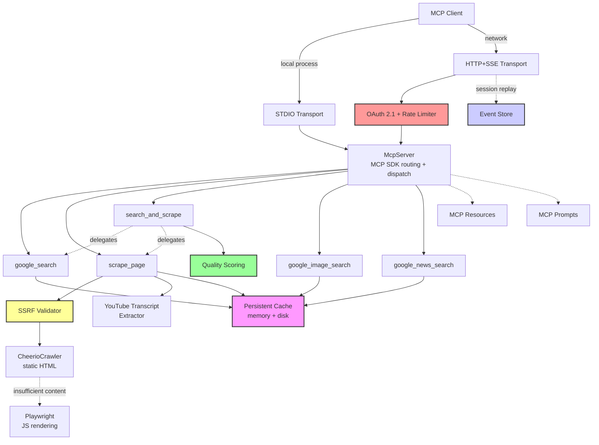

# Google Researcher MCP Server

[](https://github.com/zoharbabin/google-research-mcp/actions/workflows/ci.yml)
[](https://www.npmjs.com/package/google-researcher-mcp)
[](https://opensource.org/licenses/MIT)
[](https://nodejs.org/)

> **An MCP server that gives AI assistants real-time web research capabilities.**

This is a [Model Context Protocol (MCP)](https://modelcontextprotocol.io/) server that enables AI assistants like Claude, GPT, and other LLMs to:

- **Search the web** via Google (general, images, news)
- **Read any webpage** including JavaScript-rendered sites
- **Extract YouTube transcripts** automatically
- **Parse documents** (PDF, DOCX, PPTX)

Built for production use with caching, quality scoring, and enterprise security.

## Quick Start

### Zero-Install (npx)

The fastest way to start — no cloning required. Add this to your MCP client config:

**Claude Code** (`~/.claude/claude_desktop_config.json`), **Cline**, or **Roo Code** (MCP settings):
```json
{
  "mcpServers": {
    "google-researcher": {
      "command": "npx",
      "args": ["-y", "google-researcher-mcp"],
      "env": {
        "GOOGLE_CUSTOM_SEARCH_API_KEY": "your-key",
        "GOOGLE_CUSTOM_SEARCH_ID": "your-cx"
      }
    }
  }
}
```

Replace `your-key` and `your-cx` with your [Google Custom Search API Key](https://developers.google.com/custom-search/v1/introduction) and [Search Engine ID](https://programmablesearchengine.google.com/).

### Local Development

```bash
git clone https://github.com/zoharbabin/google-research-mcp.git && cd google-researcher-mcp
npm install && npx playwright install chromium
cp .env.example .env   # Then add your Google API keys to .env
npm run dev            # Server is now running on STDIO transport
```

> **Note:** This starts the server in STDIO mode, which is all you need for local AI assistant integrations. HTTP transport with OAuth is only required for web-based or multi-client setups — see [Choosing a Transport](#choosing-a-transport).

### Verify It Works

Once configured, ask your AI assistant:
> "Search for the latest news about AI regulations"

The assistant will use the `google_news_search` tool and return current articles. If you see search results, the server is working correctly.

---

## For AI Assistants (LLMs)

**If you are an AI assistant reading this**, here's how to use this MCP server:

### Recommended Tool Selection

| Your Task | Use This Tool |
|-----------|---------------|
| Research a topic, answer a question | `search_and_scrape` — searches AND retrieves content in one call (recommended) |
| Complex multi-step investigation | `sequential_search` — tracks progress across 3+ searches, supports branching |
| Find academic papers | `academic_search` — searches arXiv, PubMed, IEEE with citations (APA, MLA, BibTeX) |
| Search patents | `patent_search` — Google Patents for prior art, FTO analysis |
| Find recent news | `google_news_search` — with freshness filtering and date sorting |
| Find images | `google_image_search` — with size/type/color filtering |
| Get a list of URLs only | `google_search` — when you need URLs but will process pages yourself |
| Read a specific URL | `scrape_page` — also extracts YouTube transcripts and parses PDF/DOCX/PPTX |

### Example Tool Calls

```json
// Research a topic (RECOMMENDED for most queries)
{ "name": "search_and_scrape", "arguments": { "query": "climate change effects 2024", "num_results": 5 } }

// Multi-step research with tracking (for complex investigations)
{ "name": "sequential_search", "arguments": { "searchStep": "Starting research on quantum computing", "stepNumber": 1, "totalStepsEstimate": 4, "nextStepNeeded": true } }

// Find academic papers (peer-reviewed sources with citations)
{ "name": "academic_search", "arguments": { "query": "transformer neural networks", "num_results": 5 } }

// Search patents (prior art, FTO analysis)
{ "name": "patent_search", "arguments": { "query": "machine learning optimization", "search_type": "prior_art" } }

// Get recent news
{ "name": "google_news_search", "arguments": { "query": "AI regulations", "freshness": "week" } }

// Find images
{ "name": "google_image_search", "arguments": { "query": "solar panel installation", "type": "photo" } }

// Read a specific page
{ "name": "scrape_page", "arguments": { "url": "https://example.com/article" } }

// Get YouTube transcript
{ "name": "scrape_page", "arguments": { "url": "https://www.youtube.com/watch?v=VIDEO_ID" } }
```

### Key Behaviors

- **Caching**: Results are cached (30 min for search, 1 hour for scrape). Repeated queries are fast.
- **Quality Scoring**: `search_and_scrape` ranks sources by relevance, freshness, authority, and content quality.
- **Graceful Failures**: If some sources fail, you still get results from successful ones.
- **Document Support**: `scrape_page` auto-detects PDFs, DOCX, PPTX and extracts text.

---

## Table of Contents

- [For AI Assistants (LLMs)](#for-ai-assistants-llms)
- [Available Tools](#available-tools)
- [Features](#features)
- [System Architecture](#system-architecture)
- [Getting Started](#getting-started)
  - [Prerequisites](#prerequisites)
  - [Installation & Setup](#installation--setup)
  - [Running the Server](#running-the-server)
  - [Running with Docker](#running-with-docker)
- [Usage](#usage)
  - [Choosing a Transport](#choosing-a-transport)
  - [Client Integration](#client-integration)
  - [Management API](#management-api)
- [Security](#security)
  - [OAuth 2.1 Authorization](#oauth-21-authorization)
  - [Available Scopes](#available-scopes)
- [MCP Resources](#mcp-resources)
- [MCP Prompts](#mcp-prompts)
- [Testing](#testing)
- [Development Tools](#development-tools)
  - [MCP Inspector](#mcp-inspector)
- [Troubleshooting](#troubleshooting)
- [Roadmap](#roadmap)
- [Contributing](#contributing)
- [License](#license)

## Available Tools

### When to Use Each Tool

| Tool | Best For | Use When... |
| :--- | :--- | :--- |
| **`search_and_scrape`** | **Research (recommended)** | You need to answer a question using web sources. Most efficient — searches AND retrieves content in one call. Sources are quality-scored. |
| **`sequential_search`** | **Complex investigations** | 3+ searches needed with different angles, or research you might abandon early. Tracks progress, supports branching. You reason; it tracks state. |
| **`academic_search`** | **Peer-reviewed papers** | Research requiring authoritative academic sources. Returns papers with citations (APA, MLA, BibTeX), abstracts, and PDF links. |
| **`patent_search`** | **Patent research** | Prior art search, freedom to operate (FTO) analysis, patent landscaping. Returns patents with numbers, assignees, inventors, and PDF links. |
| **`google_search`** | Finding URLs only | You only need a list of URLs (not their content), or want to process pages yourself with custom logic. |
| **`google_image_search`** | Finding images | You need visual content — photos, illustrations, graphics. For text research, use search_and_scrape. |
| **`google_news_search`** | Current news | You need recent news articles. Use scrape_page on results to read full articles. |
| **`scrape_page`** | Reading a specific URL | You have a URL and need its content. Auto-handles YouTube transcripts and documents (PDF, DOCX, PPTX). |

### Tool Reference

#### `search_and_scrape` (Recommended for research)
Searches Google and retrieves content from top results in one call. Returns quality-scored, deduplicated text with source attribution. Includes size metadata (`estimatedTokens`, `sizeCategory`, `truncated`) in response.

| Parameter | Type | Default | Description |
|-----------|------|---------|-------------|
| `query` | string | required | Search query (1-500 chars) |
| `num_results` | number | 3 | Number of results (1-10) |
| `include_sources` | boolean | true | Append source URLs |
| `deduplicate` | boolean | true | Remove duplicate content |
| `max_length_per_source` | number | 50KB | Max content per source in chars |
| `total_max_length` | number | 300KB | Max total combined content in chars |
| `filter_by_query` | boolean | false | Filter to only paragraphs containing query keywords |

#### `google_search`
Returns ranked URLs from Google. Use when you only need links, not content.

| Parameter | Type | Default | Description |
|-----------|------|---------|-------------|
| `query` | string | required | Search query (1-500 chars) |
| `num_results` | number | 5 | Number of results (1-10) |
| `time_range` | string | - | `day`, `week`, `month`, `year` |
| `site_search` | string | - | Limit to domain |
| `exact_terms` | string | - | Required phrase |
| `exclude_terms` | string | - | Exclude words |

#### `google_image_search`
Searches Google Images with filtering options.

| Parameter | Type | Default | Description |
|-----------|------|---------|-------------|
| `query` | string | required | Search query (1-500 chars) |
| `num_results` | number | 5 | Number of results (1-10) |
| `size` | string | - | `huge`, `large`, `medium`, `small` |
| `type` | string | - | `clipart`, `face`, `lineart`, `photo`, `animated` |
| `color_type` | string | - | `color`, `gray`, `mono`, `trans` |
| `file_type` | string | - | `jpg`, `gif`, `png`, `bmp`, `svg`, `webp` |

#### `google_news_search`
Searches Google News with freshness and date sorting.

| Parameter | Type | Default | Description |
|-----------|------|---------|-------------|
| `query` | string | required | Search query (1-500 chars) |
| `num_results` | number | 5 | Number of results (1-10) |
| `freshness` | string | week | `hour`, `day`, `week`, `month`, `year` |
| `sort_by` | string | relevance | `relevance`, `date` |
| `news_source` | string | - | Filter to specific source |

#### `scrape_page`
Extracts text from any URL. Auto-detects: web pages (static/JS), YouTube (transcript), documents (PDF/DOCX/PPTX).

| Parameter | Type | Default | Description |
|-----------|------|---------|-------------|
| `url` | string | required | URL to scrape (max 2048 chars) |
| `max_length` | number | 50KB | Maximum content length in chars. Content exceeding this is truncated at natural breakpoints. |
| `mode` | string | full | `full` returns content, `preview` returns metadata + structure only (useful to check size before fetching) |

#### `sequential_search`
Tracks multi-step research state. Following the `sequential_thinking` pattern: **you do the reasoning, the tool tracks state**.

| Parameter | Type | Default | Description |
|-----------|------|---------|-------------|
| `searchStep` | string | required | Description of current step (1-2000 chars) |
| `stepNumber` | number | required | Current step number (starts at 1) |
| `totalStepsEstimate` | number | 5 | Estimated total steps (1-50) |
| `nextStepNeeded` | boolean | required | `true` if more steps needed, `false` when done |
| `source` | object | - | Source found: `{ url, summary, qualityScore? }` |
| `knowledgeGap` | string | - | Gap identified — what's still missing |
| `isRevision` | boolean | - | `true` if revising a previous step |
| `revisesStep` | number | - | Step number being revised |
| `branchId` | string | - | Identifier for branching research |

#### `academic_search`
Searches academic papers via Google Custom Search API, filtered to academic sources (arXiv, PubMed, IEEE, Nature, Springer, etc.). Returns papers with pre-formatted citations.

| Parameter | Type | Default | Description |
|-----------|------|---------|-------------|
| `query` | string | required | Search query (1-500 chars) |
| `num_results` | number | 5 | Number of papers (1-10) |
| `year_from` | number | - | Filter by min publication year |
| `year_to` | number | - | Filter by max publication year |
| `source` | string | all | `all`, `arxiv`, `pubmed`, `ieee`, `nature`, `springer` |
| `pdf_only` | boolean | false | Only return results with PDF links |
| `sort_by` | string | relevance | `relevance`, `date` |

#### `patent_search`
Searches Google Patents for prior art, freedom to operate (FTO) analysis, and patent landscaping. Returns patents with numbers, assignees, inventors, and PDF links.

| Parameter | Type | Default | Description |
|-----------|------|---------|-------------|
| `query` | string | required | Search query (1-500 chars) |
| `num_results` | number | 5 | Number of results (1-10) |
| `search_type` | string | prior_art | `prior_art`, `specific`, `landscape` |
| `patent_office` | string | all | `all`, `US`, `EP`, `WO`, `JP`, `CN`, `KR` |
| `assignee` | string | - | Filter by assignee/company |
| `inventor` | string | - | Filter by inventor name |
| `cpc_code` | string | - | Filter by CPC classification code |
| `year_from` | number | - | Filter by min year |
| `year_to` | number | - | Filter by max year |

## Features

### Core Capabilities
| Feature | Description |
|---------|-------------|
| **Web Scraping** | Fast static HTML + automatic Playwright fallback for JavaScript-rendered pages |
| **YouTube Transcripts** | Robust extraction with retry logic and 10 classified error types |
| **Document Parsing** | Auto-detects and extracts text from PDF, DOCX, PPTX |
| **Quality Scoring** | Sources ranked by relevance (35%), freshness (20%), authority (25%), content quality (20%) |

### MCP Protocol Support
| Feature | Description |
|---------|-------------|
| **Tools** | 8 tools: `search_and_scrape`, `google_search`, `google_image_search`, `google_news_search`, `scrape_page`, `sequential_search`, `academic_search`, `patent_search` |
| **Resources** | Expose server state (recent searches, cache stats, config) |
| **Prompts** | Pre-built templates: `comprehensive-research`, `fact-check`, `summarize-url`, `news-briefing` |
| **Annotations** | Content tagged with audience, priority, and timestamps |

### Production Ready
| Feature | Description |
|---------|-------------|
| **Caching** | Two-layer (memory + disk) with per-tool namespaces, reduces API costs |
| **Dual Transport** | STDIO for local clients, HTTP+SSE for web apps |
| **Security** | OAuth 2.1, SSRF protection, granular scopes |
| **Resilience** | Circuit breaker, timeouts, graceful degradation |
| **Monitoring** | Admin endpoints for cache stats, event store, health checks |

For detailed documentation: [YouTube Transcripts](./docs/youtube-transcript-extraction.md) · [Architecture](./docs/architecture/architecture.md) · [Testing](./docs/testing-guide.md)

## System Architecture



For a detailed explanation, see the [Architecture Guide](./docs/architecture/architecture.md).

## Getting Started

### Prerequisites

- **Node.js** 20.0.0 or higher
- **Google API Keys**:
  - [Custom Search API Key](https://developers.google.com/custom-search/v1/introduction)
  - [Custom Search Engine ID](https://programmablesearchengine.google.com/)
- **Chromium** (for JavaScript rendering): Installed automatically via `npx playwright install chromium`
- **OAuth 2.1 Provider** (HTTP transport only): An external authorization server (e.g., Auth0, Okta) to issue JWTs. Not needed for STDIO.

### Installation & Setup

1.  **Clone the Repository**:
    ```bash
    git clone https://github.com/zoharbabin/google-research-mcp.git
    cd google-researcher-mcp
    ```

2.  **Install Dependencies**:
    ```bash
    npm install
    npx playwright install chromium
    ```

3.  **Configure Environment Variables**:
    ```bash
    cp .env.example .env
    ```
    Open `.env` and add your Google API keys. All other variables are optional — see the comments in `.env.example` for detailed explanations.

### Running the Server

-   **Development** (auto-reload on file changes):
    ```bash
    npm run dev
    ```

-   **Production**:
    ```bash
    npm run build
    npm start
    ```

### Running with Docker

```bash
# Build the image
docker build -t google-researcher-mcp .

# Run in STDIO mode (default, for MCP clients)
docker run -i --rm --env-file .env google-researcher-mcp

# Run with HTTP transport on port 3000
# (MCP_TEST_MODE= overrides the Dockerfile default of "stdio" to enable HTTP)
docker run -d --rm --env-file .env -e MCP_TEST_MODE= -p 3000:3000 google-researcher-mcp
```

**Docker Compose** (quick HTTP transport setup):
```bash
cp .env.example .env   # Fill in your API keys
docker compose up --build
curl http://localhost:3000/health
```

**Docker with Claude Code** (`~/.claude/claude_desktop_config.json`):
```json
{
  "mcpServers": {
    "google-researcher": {
      "command": "docker",
      "args": ["run", "-i", "--rm", "--env-file", "/path/to/.env", "google-researcher-mcp"]
    }
  }
}
```

**Security note:** Never bake secrets into the Docker image. Always pass them at runtime via `--env-file` or `-e` flags.

## Usage

### Choosing a Transport

| | STDIO | HTTP+SSE |
|---|---|---|
| **Best for** | Local MCP clients (Claude Code, Cline, Roo Code) | Web apps, multi-client setups, remote access |
| **Auth** | None needed (process-level isolation) | OAuth 2.1 Bearer tokens required |
| **Setup** | Zero config — just provide API keys | Requires OAuth provider (Auth0, Okta, etc.) |
| **Scaling** | One server per client process | Single server, many concurrent clients |

**Recommendation**: Use **STDIO** for local AI assistant integrations. Use **HTTP+SSE** only when you need a shared service or web application integration.

### Client Integration

#### STDIO Client (Local Process)

```javascript
import { Client } from "@modelcontextprotocol/sdk/client/index.js";
import { StdioClientTransport } from "@modelcontextprotocol/sdk/client/stdio.js";

const transport = new StdioClientTransport({
  command: "node",
  args: ["dist/server.js"]
});
const client = new Client({ name: "my-client" });
await client.connect(transport);

// Search Google
const searchResult = await client.callTool({
  name: "google_search",
  arguments: { query: "Model Context Protocol" }
});
console.log(searchResult.content[0].text);

// Extract a YouTube transcript
const transcript = await client.callTool({
  name: "scrape_page",
  arguments: { url: "https://www.youtube.com/watch?v=dQw4w9WgXcQ" }
});
console.log(transcript.content[0].text);
```

#### HTTP+SSE Client (Web Application)

Requires a valid OAuth 2.1 Bearer token from your configured authorization server.

```javascript
import { Client } from "@modelcontextprotocol/sdk/client/index.js";
import { StreamableHTTPClientTransport } from "@modelcontextprotocol/sdk/client/streamableHttp.js";

const transport = new StreamableHTTPClientTransport(
  new URL("http://localhost:3000/mcp"),
  {
    getAuthorization: async () => `Bearer YOUR_ACCESS_TOKEN`
  }
);
const client = new Client({ name: "my-client" });
await client.connect(transport);

const result = await client.callTool({
  name: "search_and_scrape",
  arguments: { query: "Model Context Protocol", num_results: 3 }
});
console.log(result.content[0].text);
```

### Management API

Administrative and monitoring endpoints (HTTP transport only):

| Method | Endpoint | Description | Auth |
|--------|----------|-------------|------|
| `GET` | `/health` | Server health check (status, version, uptime) | Public |
| `GET` | `/version` | Server version and runtime info | Public |
| `GET` | `/mcp/cache-stats` | Cache performance statistics | `mcp:admin:cache:read` |
| `GET` | `/mcp/event-store-stats` | Event store usage statistics | `mcp:admin:event-store:read` |
| `POST` | `/mcp/cache-invalidate` | Clear specific cache entries | `mcp:admin:cache:invalidate` |
| `POST` | `/mcp/cache-persist` | Force cache save to disk | `mcp:admin:cache:persist` |
| `GET` | `/mcp/oauth-config` | Current OAuth configuration | `mcp:admin:config:read` |
| `GET` | `/mcp/oauth-scopes` | OAuth scopes documentation | Public |
| `GET` | `/mcp/oauth-token-info` | Token details | Authenticated |

## Security

### OAuth 2.1 Authorization

All HTTP endpoints under `/mcp/` (except public documentation) are protected by OAuth 2.1:

- **Token Validation**: JWTs are validated against your authorization server's JWKS endpoint (`${OAUTH_ISSUER_URL}/.well-known/jwks.json`).
- **Scope Enforcement**: Each tool and admin action requires a specific OAuth scope.

Configure `OAUTH_ISSUER_URL` and `OAUTH_AUDIENCE` in `.env`. See `.env.example` for details.

> **STDIO users**: OAuth is not used for STDIO transport. You can skip all OAuth configuration.

### Available Scopes

**Tool Execution:**
- `mcp:tool:google_search:execute`
- `mcp:tool:google_image_search:execute`
- `mcp:tool:google_news_search:execute`
- `mcp:tool:scrape_page:execute`
- `mcp:tool:search_and_scrape:execute`

**Administration:**
- `mcp:admin:cache:read`
- `mcp:admin:cache:invalidate`
- `mcp:admin:cache:persist`
- `mcp:admin:event-store:read`
- `mcp:admin:config:read`

## MCP Resources

The server exposes state via the [MCP Resources protocol](https://modelcontextprotocol.io/docs/specification/resources). Use `resources/list` to discover available resources and `resources/read` to retrieve them.

| URI | Description |
|-----|-------------|
| `search://recent` | Last 20 search queries with timestamps and result counts |
| `config://server` | Server configuration (version, start time, transport mode) |
| `stats://cache` | Cache statistics (hit rate, entry count, memory usage) |
| `stats://events` | Event store statistics (event count, storage size) |

**Example** (using MCP SDK):
```javascript
const resources = await client.listResources();
const recentSearches = await client.readResource({ uri: "search://recent" });
```

## MCP Prompts

Pre-built research workflow templates are available via the [MCP Prompts protocol](https://modelcontextprotocol.io/docs/specification/prompts). Use `prompts/list` to discover prompts and `prompts/get` to retrieve a prompt with arguments.

### Basic Research Prompts

| Prompt | Arguments | Description |
|--------|-----------|-------------|
| `comprehensive-research` | `topic`, `depth` (quick/standard/deep) | Multi-source research on a topic |
| `fact-check` | `claim`, `sources` (number) | Verify a claim against multiple sources |
| `summarize-url` | `url`, `format` (brief/detailed/bullets) | Summarize content from a single URL |
| `news-briefing` | `topic`, `timeRange` (day/week/month) | Get current news summary on a topic |

### Advanced Research Prompts

| Prompt | Arguments | Description |
|--------|-----------|-------------|
| `patent-portfolio-analysis` | `company`, `includeSubsidiaries` | Analyze a company's patent holdings |
| `competitive-analysis` | `entities` (comma-separated), `aspects` | Compare companies/products |
| `literature-review` | `topic`, `yearFrom`, `sources` | Academic literature synthesis |
| `technical-deep-dive` | `technology`, `focusArea` | In-depth technical investigation |

**Focus areas for `technical-deep-dive`:** `architecture`, `implementation`, `comparison`, `best-practices`, `troubleshooting`

**Example** (using MCP SDK):
```javascript
const prompts = await client.listPrompts();

// Basic research
const research = await client.getPrompt({
  name: "comprehensive-research",
  arguments: { topic: "quantum computing", depth: "standard" }
});

// Advanced: Patent analysis
const patents = await client.getPrompt({
  name: "patent-portfolio-analysis",
  arguments: { company: "Kaltura", includeSubsidiaries: true }
});

// Advanced: Competitive analysis
const comparison = await client.getPrompt({
  name: "competitive-analysis",
  arguments: { entities: "React, Vue, Angular", aspects: "performance, learning curve, ecosystem" }
});
```

## Testing

| Script | Description |
|--------|-------------|
| `npm test` | Run all unit/component tests (Jest) |
| `npm run test:e2e` | Full end-to-end suite (STDIO + HTTP + YouTube) |
| `npm run test:coverage` | Generate code coverage report |
| `npm run test:e2e:stdio` | STDIO transport E2E only |
| `npm run test:e2e:sse` | HTTP transport E2E only |
| `npm run test:e2e:youtube` | YouTube transcript E2E only |

**All NPM scripts:**

| Script | Description |
|--------|-------------|
| `npm start` | Run the built server (production) |
| `npm run dev` | Start with live-reload (development) |
| `npm run build` | Compile TypeScript to `dist/` |
| `npm run inspect` | Open MCP Inspector for interactive debugging |

For testing philosophy and structure, see the [Testing Guide](./docs/testing-guide.md).

## Development Tools

### MCP Inspector

The [MCP Inspector](https://github.com/modelcontextprotocol/inspector) is a visual debugging tool for MCP servers. Use it to interactively test tools, browse resources, and verify prompts.

**Run the Inspector:**
```bash
npm run inspect
```

This opens a browser interface at `http://localhost:5173` connected to the server via STDIO.

**What to Expect:**

| Primitive | Count | Items |
|-----------|-------|-------|
| **Tools** | 8 | `google_search`, `google_image_search`, `google_news_search`, `scrape_page`, `search_and_scrape`, `sequential_search`, `academic_search`, `patent_search` |
| **Resources** | 6 | `search://recent`, `config://server`, `stats://cache`, `stats://events`, `search://session/current`, `stats://resources` |
| **Prompts** | 8 | `comprehensive-research`, `fact-check`, `summarize-url`, `news-briefing`, `patent-portfolio-analysis`, `competitive-analysis`, `literature-review`, `technical-deep-dive` |

**Troubleshooting Inspector Issues:**

- **"Cannot find module" error**: Run `npm run build` first — Inspector requires compiled JavaScript.
- **Tool calls fail with API errors**: Ensure `GOOGLE_CUSTOM_SEARCH_API_KEY` and `GOOGLE_CUSTOM_SEARCH_ID` are set in your `.env` file.
- **Port 5173 in use**: The Inspector UI runs on port 5173. Stop other services using that port or check if another Inspector instance is running.
- **Server crashes on startup**: Check that all dependencies are installed (`npm install`) and Playwright is set up (`npx playwright install chromium`).

## Troubleshooting

- **Server won't start**: Ensure `GOOGLE_CUSTOM_SEARCH_API_KEY` and `GOOGLE_CUSTOM_SEARCH_ID` are set in `.env`. The server exits with a clear error if either is missing.
- **Empty scrape results**: The persistent cache may contain stale entries. Delete `storage/persistent_cache/namespaces/scrapePage/` and restart to force fresh scrapes.
- **Playwright/Chromium errors**: Re-run `npx playwright install chromium`. On Linux, also run `npx playwright install-deps chromium` for system dependencies. In Docker, these are pre-installed.
- **Port 3000 in use**: Stop the other process (`lsof -ti:3000 | xargs kill`) or set `PORT=3001 npm start`.
- **YouTube transcripts fail**: Some videos have transcripts disabled by the owner. The error message includes the specific reason (e.g., `TRANSCRIPT_DISABLED`, `VIDEO_UNAVAILABLE`). See the [YouTube Transcript Documentation](./docs/youtube-transcript-extraction.md) for all error codes.
- **Cache issues**: Use `/mcp/cache-stats` to inspect cache health, or `/mcp/cache-persist` to force a save. See the [Management API](#management-api).
- **OAuth errors**: Verify `OAUTH_ISSUER_URL` and `OAUTH_AUDIENCE` in `.env`. Use `/mcp/oauth-config` to inspect current configuration.
- **Docker health check failing**: The health check hits `/health` on port 3000, which requires HTTP transport. In STDIO mode (`MCP_TEST_MODE=stdio`), the health check will fail — this is expected.

## Roadmap

Feature requests and improvements are tracked as [GitHub Issues](https://github.com/zoharbabin/google-research-mcp/issues). Contributions welcome.

## Contributing

We welcome contributions of all kinds! Please see the [Contribution Guidelines](./docs/CONTRIBUTING.md) for details.

## License

This project is licensed under the MIT License. See the [LICENSE](./LICENSE) file for details.
