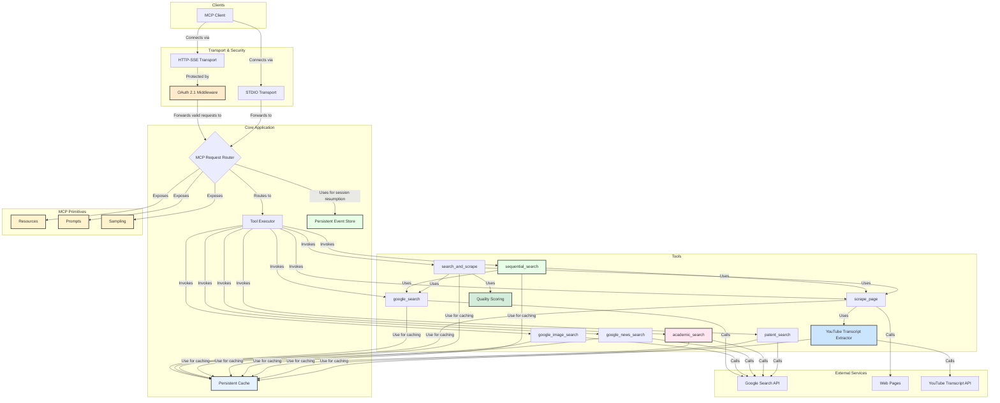

# Architecture Guide: Google Researcher MCP Server

This document provides a comprehensive overview of the Google Researcher MCP Server's architecture. It's intended for developers, system administrators, and anyone interested in understanding how the server is built, how it operates, and how to extend it.

## Table of Contents

1.  [**High-Level Overview**](#high-level-overview)
2.  [**Core Architectural Principles**](#core-architectural-principles)
3.  [**System Architecture Diagram**](#system-architecture-diagram)
4.  [**Component Deep-Dive**](#component-deep-dive)
    -   [Transport Layer (STDIO & HTTP/SSE)](#transport-layer)
    -   [Security Layer (OAuth 2.1)](#security-layer)
    -   [MCP Core (Request Handling)](#mcp-core)
    -   [Tools Layer (Capabilities)](#tools-layer)
    -   [Caching System](#caching-system)
    -   [Event Store](#event-store)
5.  [**Data and Control Flow**](#data-and-control-flow)
6.  [**Extensibility and Customization**](#extensibility-and-customization)
7.  [**Deployment and Scaling**](#deployment-and-scaling)

---

## High-Level Overview

The Google Researcher MCP Server is a backend service that implements the [Model Context Protocol (MCP)](https://github.com/zoharbabin/google-research-mcp). Its primary purpose is to empower AI assistants and other clients with a powerful suite of research-oriented tools:

-   **`google_search`**: Executes queries against the Google Search API. Supports recency filtering via `time_range` and advanced filters.
-   **`google_image_search`**: Searches Google Images with filtering by size, type, color, and file format.
-   **`google_news_search`**: Searches Google News with freshness filtering and date-based sorting.
-   **`scrape_page`**: Extracts text content from web pages, YouTube videos, and documents (PDF, DOCX, PPTX). Supports `max_length` and `mode: 'preview'` for content size control.
-   **`search_and_scrape`**: A composite tool that searches Google and scrapes the top results in parallel, with quality scoring and ranking. Includes size metadata and content truncation options.
-   **`sequential_search`**: Tracks multi-step research state following the `sequential_thinking` pattern. Tracks steps, sources, knowledge gaps, and supports branching.
-   **`academic_search`**: Searches academic papers via Google Custom Search API (filtered to arXiv, PubMed, IEEE, etc.) with pre-formatted citations (APA, MLA, BibTeX).
-   **`patent_search`**: Searches Google Patents for prior art, FTO analysis, and patent landscaping. Supports filtering by patent office, assignee, inventor, and CPC code.

The server also exposes:
-   **MCP Resources**: Server state (recent searches, cache stats, configuration) via the Resources protocol.
-   **MCP Prompts**: Pre-built research workflow templates (comprehensive research, fact-check, summarize, news briefing).

To deliver these capabilities reliably and efficiently, the server is built with production-grade features, including quality scoring, content deduplication, a two-layer persistent cache, robust timeout and error handling, and enterprise-grade security for its web-facing endpoints.

## Core Architectural Principles

-   **Separation of Concerns**: Each component has a distinct responsibility, from transport handling to tool execution. This makes the system easier to understand, maintain, and extend.
-   **Modularity and Extensibility**: The server is designed to be easily extended with new tools, caching strategies, or even transport methods.
-   **Performance and Efficiency**: A sophisticated caching system minimizes latency and reduces reliance on expensive external API calls.
-   **Reliability and Resilience**: Comprehensive timeout handling and graceful degradation ensure the server remains stable and responsive, even when external services are slow or fail.
-   **Security by Default**: All web-facing endpoints are protected by an industry-standard OAuth 2.1 authorization layer.

## Project Structure

```
google-researcher-mcp/
├── src/                          # Source code
│   ├── server.ts                 # Main entry point (transport, tools, routing)
│   ├── cache/                    # Caching system (persistent LRU cache)
│   │   ├── persistentCache.ts    # Main cache implementation
│   │   ├── persistenceManager.ts # Disk persistence layer
│   │   └── types.ts              # Cache interfaces
│   ├── documents/                # Document parsing (PDF, DOCX, PPTX)
│   ├── prompts/                  # MCP Prompts (research templates)
│   ├── resources/                # MCP Resources (server state)
│   ├── schemas/                  # Zod schemas for tool outputs
│   ├── shared/                   # Shared utilities
│   │   ├── circuitBreaker.ts     # Resilience for external APIs
│   │   ├── contentAnnotations.ts # MCP content annotations
│   │   ├── contentDeduplication.ts
│   │   ├── contentSizeOptimization.ts
│   │   ├── citationExtractor.ts  # Citation metadata extraction
│   │   ├── envValidator.ts       # Startup validation
│   │   ├── logger.ts             # Structured logging
│   │   ├── oauthMiddleware.ts    # OAuth 2.1 for HTTP transport
│   │   ├── patentConstants.ts    # Shared patent constants and helpers
│   │   ├── persistentEventStore.ts # SSE session replay
│   │   ├── qualityScoring.ts     # Source ranking
│   │   └── urlValidator.ts       # SSRF protection
│   ├── tools/                    # Standalone tool implementations
│   │   ├── academicSearch.ts     # Academic paper search
│   │   ├── patentSearch.ts       # Patent search (Google Patents)
│   │   ├── sequentialSearch.ts   # Multi-step research tracking
│   │   └── toolMetadata.ts       # Icons and metadata for all tools
│   ├── types/                    # TypeScript type definitions
│   └── youtube/                  # YouTube transcript extraction
├── docs/                         # Documentation
│   ├── architecture/             # Architecture guides
│   ├── CHANGELOG.md              # Version history
│   ├── CONTRIBUTING.md           # Contribution guidelines
│   └── testing-guide.md          # Testing philosophy
├── tests/                        # End-to-end tests
│   └── e2e/                      # STDIO/SSE transport tests
├── .env.example                  # Environment variable template
├── Dockerfile                    # Container image
└── package.json                  # Dependencies and scripts
```

**Key Entry Points:**
- **For users**: Start with `README.md` → Quick Start section
- **For AI assistants**: `README.md` → "For AI Assistants (LLMs)" section
- **For developers**: `docs/CONTRIBUTING.md` → Development setup
- **For architecture**: This document → Component Deep-Dive section

## System Architecture Diagram

The server employs a layered architecture that clearly defines the flow of data and control from the client to the external services.



## Component Deep-Dive

### Transport Layer

The server supports two distinct communication protocols to accommodate different client environments.

#### STDIO Transport
-   **File**: [`src/server.ts`](../src/server.ts)
-   **Description**: A simple, direct communication channel using standard input and output. The client runs the server as a child process and communicates over its `stdin` and `stdout` streams.
-   **Use Case**: Ideal for local integrations, such as CLI tools or IDE extensions (e.g., Roo Code) running on the same machine.
-   **Security**: Inherits the security context of the parent process; no additional authentication is applied.

#### HTTP/SSE Transport
-   **File**: [`src/server.ts`](../src/server.ts)
-   **Description**: A web-based transport using an Express.js server. It accepts POST requests at the `/mcp` endpoint and streams responses back using [Server-Sent Events (SSE)](https://developer.mozilla.org/en-US/docs/Web/API/Server-sent_events/Using_server-sent_events).
-   **Use Case**: For web applications and remote clients that communicate over a network.
-   **Features**: Supports session management and reliable message delivery via the [Persistent Event Store](#event-store).

### Security Layer

-   **File**: [`src/shared/oauthMiddleware.ts`](../src/shared/oauthMiddleware.ts)
-   **Description**: All HTTP-based endpoints (both for MCP and management) are protected by an OAuth 2.1 authorization layer. This middleware intercepts incoming requests and validates the `Authorization: Bearer <token>` header.
-   **Process**:
    1.  Extracts the JWT from the header.
    2.  Fetches the JSON Web Key Set (JWKS) from the configured authorization server's URL.
    3.  Verifies the token's signature against the appropriate public key.
    4.  Validates standard claims (issuer, audience, expiration).
    5.  Attaches the decoded token payload to the request object for downstream use.
-   **Scope Enforcement**: A secondary middleware, `requireScopes`, ensures that the validated token contains the specific permissions (scopes) required for the requested tool or management action.

For security configuration details, see the OAuth 2.1 section in the [**README**](../../README.md#oauth-21-authorization).

### MCP Core

-   **Library**: `@modelcontextprotocol/sdk`
-   **Description**: The heart of the server, responsible for implementing the MCP specification. It parses incoming JSON-RPC 2.0 requests, routes them to the appropriate registered tool handler, and formats the responses.

### Tools Layer

-   **File**: [`src/server.ts`](../src/server.ts)
-   **Description**: This layer contains the concrete implementation of the server's capabilities. Each tool is registered with the MCP Core and is responsible for a specific action. All tools are designed to be stateless and rely on the caching system for performance.
-   **Timeout Handling**: Each tool that interacts with an external network has a built-in timeout to prevent it from hanging indefinitely. This is a critical component of the server's reliability.

### YouTube Transcript Extractor
-   **File**: [`src/youtube/transcriptExtractor.ts`](../src/youtube/transcriptExtractor.ts)
-   **Description**: A specialized component responsible for fetching, parsing, and cleaning transcripts from YouTube videos. It is designed for high reliability and resilience.
-   **Key Features**:
    -   **Robust Error Handling**: Identifies 10 distinct error types and provides clear, user-friendly messages.
    -   **Automatic Retries**: Implements an exponential backoff strategy to handle transient network errors and rate limiting.
    -   **Performance Optimized**: Significantly faster and more efficient than previous methods.
-   **Integration**: This component is used exclusively by the `scrape_page` tool when a YouTube URL is detected.
-   **Further Reading**: [**YouTube Transcript Extraction Technical Documentation**](../youtube-transcript-extraction.md)

### Quality Scoring

-   **File**: [`src/shared/qualityScoring.ts`](../src/shared/qualityScoring.ts)
-   **Description**: Scores and ranks sources based on multiple quality factors.
-   **Scoring Factors**:
    -   **Relevance (35%)**: Query term matching, exact phrase detection, term frequency.
    -   **Freshness (20%)**: Publication recency with time-based decay.
    -   **Authority (25%)**: Domain reputation (.gov, .edu, major publications).
    -   **Content Quality (20%)**: Content length, structure, paragraph formatting.
-   **Integration**: Used by `search_and_scrape` to rank sources in the output.

### MCP Resources

-   **File**: [`src/resources/index.ts`](../src/resources/index.ts)
-   **Description**: Exposes server state via the MCP Resources protocol.
-   **Available Resources**:
    -   `search://recent`: Last 20 search queries with timestamps.
    -   `config://server`: Server configuration and version info.
    -   `stats://cache`: Cache performance statistics.
    -   `stats://events`: Event store statistics.
-   **Use Case**: Allows clients to inspect server state programmatically.

### MCP Prompts

-   **File**: [`src/prompts/index.ts`](../src/prompts/index.ts)
-   **Description**: Pre-built research workflow templates via the MCP Prompts protocol.
-   **Available Prompts**:
    -   `comprehensive-research`: Multi-source topic research with depth control.
    -   `fact-check`: Claim verification against multiple sources.
    -   `summarize-url`: Single URL summarization in various formats.
    -   `news-briefing`: Current news summary with time range filtering.
-   **Use Case**: Provides structured guidance for common research tasks.

### Caching System

-   **Directory**: [`src/cache/`](../src/cache/)
-   **Description**: A two-layer caching system designed to minimize latency and reduce API costs.
    -   **Layer 1: In-Memory Cache**: A fast, in-memory LRU cache for immediate access to frequently used data.
    -   **Layer 2: Disk-Based Persistent Cache**: A file-system-based cache that persists data across server restarts.
-   **Key Features**:
    -   **Namespaces**: Caches for different tools are kept separate.
    -   **Stale-While-Revalidate**: Can return stale data instantly while fetching a fresh version in the background.
    -   **Promise Coalescing**: Prevents "cache stampede" by ensuring that for a given cache key, the underlying computation is only executed once.
-   **Further Reading**: [**Caching System Architecture**](./caching-system-architecture.md)

### Event Store

-   **Directory**: [`src/shared/`](../src/shared/)
-   **Description**: The event store is crucial for the reliability of the HTTP/SSE transport. It records every message sent from the server to a client. If a client disconnects and later reconnects, the event store can "replay" any missed messages, ensuring a seamless user experience.
-   **Key Features**:
    -   **Persistence**: Like the cache, it persists events to disk.
    -   **Stream-Based**: Events are organized by session ID.
    -   **Security**: Includes optional hooks for event encryption and access control.
-   **Further Reading**: [**Event Store Architecture**](./event-store-architecture.md)

## Data and Control Flow

1.  A **Client** establishes a connection via either **STDIO** or **HTTP/SSE**.
2.  For HTTP, the **OAuth Middleware** validates the client's Bearer token.
3.  The client sends a **JSON-RPC request** to call a tool (e.g., `google_search`).
4.  The **MCP Request Router** receives the request and passes it to the **Tool Executor**.
5.  The **Tool Executor** invokes the `google_search` function.
6.  The function first checks the **Persistent Cache** for a valid, non-expired result for the given query.
7.  If a valid result is found, it's returned immediately.
8.  If not, the tool calls the external **Google Search API**.
9.  The result is stored in the **Persistent Cache** and then returned to the client.
10. For SSE clients, the response is also recorded in the **Persistent Event Store**.

## Extensibility and Customization

### Adding a New Tool

For a comprehensive step-by-step guide, see [**Adding New Tools Guide**](../ADDING_NEW_TOOLS.md).

Quick overview:
1.  **Implement the Logic**: Write a function that performs the desired action.
2.  **Integrate Caching**: Wrap the core logic with `globalCache.getOrCompute()` to ensure it's performant.
3.  **Register the Tool**: In `configureToolsAndResources`, call `server.tool()` with the tool's name, its Zod schema for input validation, and the handler function.
4.  **(HTTP only) Add a Scope**: Define a new OAuth scope for your tool in `src/shared/oauthScopes.ts` and protect its execution with `requireScopes`.

### Swapping Backends
The `PersistenceManager` for both the cache and event store can be replaced with custom implementations (e.g., to use a Redis or database backend instead of the filesystem) by creating a new class that conforms to the `IPersistenceManager` interface.

## Deployment and Scaling

-   **Configuration**: All critical parameters (API keys, cache settings, OAuth details) are configured via environment variables. See `.env.example` for a complete list.
-   **Process Management**: For production, it is recommended to use a process manager like [PM2](https://pm2.keymetrics.io/) to handle automatic restarts and logging.
-   **Containerization**: A `Dockerfile` can be used to package the server for consistent deployment in containerized environments like Docker or Kubernetes.
-   **Scaling**: For horizontal scaling (running multiple instances of the server), the default file-system-based cache and event store must be replaced with a shared backend (e.g., Redis, a shared file system) to ensure data consistency across all instances.
